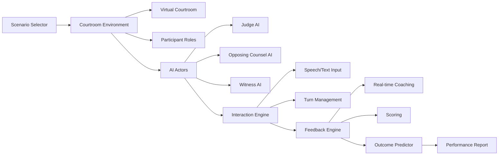

# :classical_building: Court Simulation Sandbox — Practice Before the Real Thing

[](LICENSE)
[](https://www.typescriptlang.org/)
[](CONTRIBUTING.md)
[](https://github.com/dougdevitre/court-simulation-sandbox/pulls)

## The Problem

Pro se litigants walk into court with zero practice — they don't know what to say, how to address the judge, or what to expect. The courtroom is terrifying and unfamiliar. There is no safe space to rehearse, make mistakes, and learn the unwritten rules before facing a real judge.

## The Solution

A full courtroom simulation with AI-powered role-play (judge, opposing counsel), real-time feedback, outcome prediction, and customizable scenarios. Users rehearse hearings in a realistic but forgiving environment so they walk into the real courtroom prepared and confident.

## Architecture



## Who This Helps

- **Pro se litigants** — rehearse before the real thing
- **Law students** — practice courtroom skills in a safe environment
- **Legal aid training programs** — train advocates with realistic simulations
- **Court self-help centers** — offer preparation tools to unrepresented parties

## Features

- **AI-powered judge and opposing counsel** — realistic courtroom dialogue driven by language models
- **Customizable hearing scenarios** — custody, eviction, small claims, protective orders, and more
- **Real-time courtroom etiquette feedback** — learn what to say, when to stand, and how to address the court
- **Outcome prediction based on performance** — see how your presentation affects likely outcomes
- **"Replay and improve" mode** — rerun the same scenario and beat your previous score
- **Performance scoring and improvement tracking** — track growth across sessions with detailed rubrics

## Quick Start

```bash
npm install @justice-os/court-sandbox
```

```typescript
import { Courtroom, ScenarioLoader, JudgeAI } from '@justice-os/court-sandbox';

// Load a custody hearing scenario
const scenario = await ScenarioLoader.load('custody-hearing');

// Create the courtroom session
const courtroom = new Courtroom({
  scenario,
  difficulty: 'beginner',
  feedbackLevel: 'verbose',
});

// Start the simulation
const session = await courtroom.startSession();

// The AI judge opens the hearing
const opening = await session.nextTurn();
console.log(`Judge: ${opening.dialogue}`);

// User responds
const feedback = await session.submitResponse({
  text: 'Good morning, Your Honor. I am here regarding the custody matter.',
  participantId: 'user',
});

console.log(`Etiquette Score: ${feedback.etiquetteScore}/10`);
console.log(`Coaching Tip: ${feedback.tip}`);
```

## Roadmap

- [ ] Voice input with speech-to-text for realistic oral arguments
- [ ] Multiplayer mode for moot court practice with real participants
- [ ] VR courtroom environment for immersive preparation
- [ ] Jurisdiction-specific courtroom rules and procedures
- [ ] Integration with justice-navigator for scenario recommendations
- [ ] Exportable preparation reports for legal aid advocates

## Project Structure

```
src/
├── index.ts
├── simulation/
│   ├── courtroom.ts          # Courtroom class — session management
│   ├── scenario-loader.ts    # ScenarioLoader — load hearing types
│   └── turn-manager.ts       # TurnManager — who speaks when
├── actors/
│   ├── judge-ai.ts           # JudgeAI — rulings, questions, demeanor
│   ├── opposing-counsel-ai.ts # OpposingCounselAI — objections, arguments
│   └── actor-base.ts         # BaseActor — shared AI behavior
├── feedback/
│   ├── coach.ts              # RealtimeCoach — etiquette, strategy tips
│   ├── scorer.ts             # PerformanceScorer — scoring rubric
│   └── outcome-predictor.ts  # OutcomePredictor — likelihood estimation
├── scenarios/
│   └── README.md             # How to create custom scenarios
├── components/
│   ├── CourtroomView.tsx      # Visual courtroom layout
│   ├── DialogueBox.tsx        # Conversation interface
│   └── ScoreCard.tsx          # Performance display
└── types/
    └── index.ts
```

---

## Justice OS Ecosystem

This repository is part of the **Justice OS** open-source ecosystem — 22 interconnected projects building the infrastructure for accessible justice technology.

### Core System Layer
| Repository | Description |
|-----------|-------------|
| [justice-os](https://github.com/dougdevitre/justice-os) | Core modular platform — the foundation |
| [justice-api-gateway](https://github.com/dougdevitre/justice-api-gateway) | Interoperability layer for courts |
| [legal-identity-layer](https://github.com/dougdevitre/legal-identity-layer) | Universal legal identity and auth |

### User Experience Layer
| Repository | Description |
|-----------|-------------|
| [justice-navigator](https://github.com/dougdevitre/justice-navigator) | Google Maps for legal problems |
| [mobile-court-access](https://github.com/dougdevitre/mobile-court-access) | Mobile-first court access kit |
| [cognitive-load-ui](https://github.com/dougdevitre/cognitive-load-ui) | Design system for stressed users |
| [multilingual-justice](https://github.com/dougdevitre/multilingual-justice) | Real-time legal translation |

### AI + Intelligence Layer
| Repository | Description |
|-----------|-------------|
| [vetted-legal-ai](https://github.com/dougdevitre/vetted-legal-ai) | RAG engine with citation validation |
| [justice-knowledge-graph](https://github.com/dougdevitre/justice-knowledge-graph) | Open data layer for laws and procedures |
| [legal-ai-guardrails](https://github.com/dougdevitre/legal-ai-guardrails) | AI safety SDK for justice use |

### Infrastructure + Trust Layer
| Repository | Description |
|-----------|-------------|
| [evidence-vault](https://github.com/dougdevitre/evidence-vault) | Privacy-first secure evidence storage |
| [court-notification-engine](https://github.com/dougdevitre/court-notification-engine) | Smart deadline and hearing alerts |
| [justice-analytics](https://github.com/dougdevitre/justice-analytics) | Bias detection and disparity dashboards |
| [evidence-timeline](https://github.com/dougdevitre/evidence-timeline) | Evidence timeline builder |

### Tools + Automation Layer
| Repository | Description |
|-----------|-------------|
| [court-doc-engine](https://github.com/dougdevitre/court-doc-engine) | TurboTax for legal filings |
| [justice-workflow-engine](https://github.com/dougdevitre/justice-workflow-engine) | Zapier for legal processes |
| [pro-se-toolkit](https://github.com/dougdevitre/pro-se-toolkit) | Self-represented litigant tools |
| [justice-score-engine](https://github.com/dougdevitre/justice-score-engine) | Access-to-justice measurement |

### Adoption Layer
| Repository | Description |
|-----------|-------------|
| [digital-literacy-sim](https://github.com/dougdevitre/digital-literacy-sim) | Digital literacy simulator |
| [legal-resource-discovery](https://github.com/dougdevitre/legal-resource-discovery) | Find the right help instantly |
| [court-simulation-sandbox](https://github.com/dougdevitre/court-simulation-sandbox) | Practice before the real thing |
| [justice-components](https://github.com/dougdevitre/justice-components) | Reusable component library |

> Built with purpose. Open by design. Justice for all.
