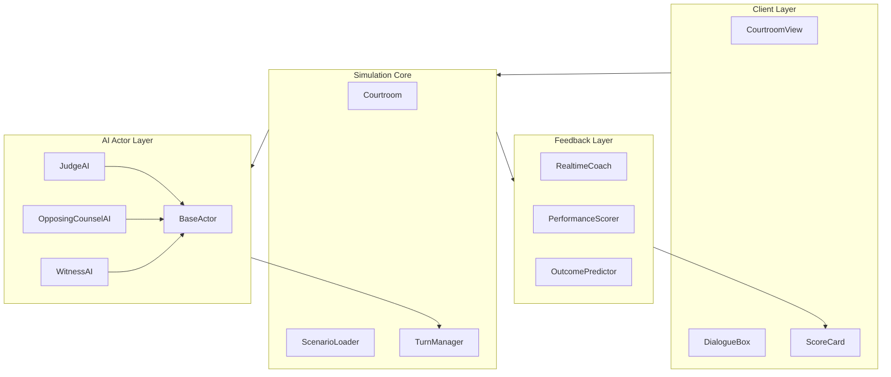
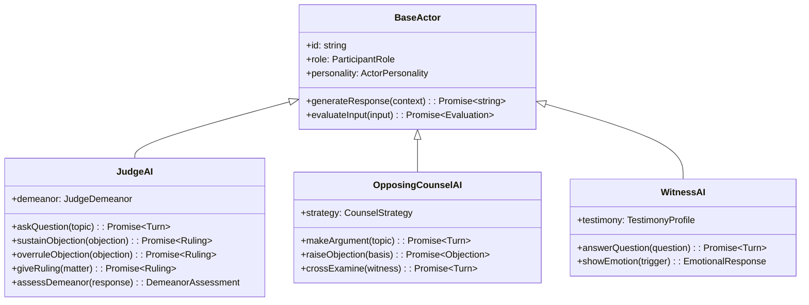
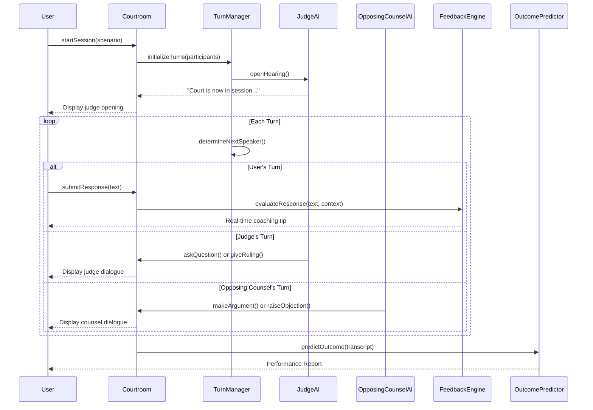
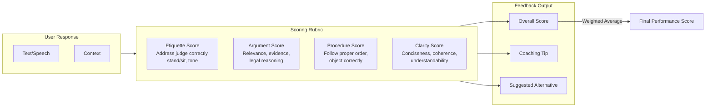
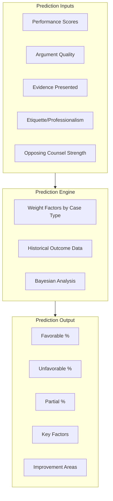

# Court Simulation Sandbox — Architecture

## Simulation Architecture

```mermaid
flowchart TB
    subgraph Client["Client Layer"]
        CV[CourtroomView]
        DB[DialogueBox]
        SC[ScoreCard]
    end

    subgraph Core["Simulation Core"]
        CR[Courtroom]
        SL[ScenarioLoader]
        TM[TurnManager]
    end

    subgraph AI["AI Actor Layer"]
        BA[BaseActor]
        JA[JudgeAI]
        OC[OpposingCounselAI]
        WA[WitnessAI]
        JA --> BA
        OC --> BA
        WA --> BA
    end

    subgraph Feedback["Feedback Layer"]
        RC[RealtimeCoach]
        PS[PerformanceScorer]
        OP[OutcomePredictor]
    end

    Client --> Core
    Core --> AI
    Core --> Feedback
    AI --> TM
    Feedback --> SC
```

## AI Actor System

```mermaid
classDiagram
    class BaseActor {
        +id: string
        +role: ParticipantRole
        +personality: ActorPersonality
        +generateResponse(context): Promise~string~
        +evaluateInput(input): Promise~Evaluation~
    }

    class JudgeAI {
        +demeanor: JudgeDemeanor
        +askQuestion(topic): Promise~Turn~
        +sustainObjection(objection): Promise~Ruling~
        +overruleObjection(objection): Promise~Ruling~
        +giveRuling(matter): Promise~Ruling~
        +assessDemeanor(response): DemeanorAssessment
    }

    class OpposingCounselAI {
        +strategy: CounselStrategy
        +makeArgument(topic): Promise~Turn~
        +raiseObjection(basis): Promise~Objection~
        +crossExamine(witness): Promise~Turn~
    }

    class WitnessAI {
        +testimony: TestimonyProfile
        +answerQuestion(question): Promise~Turn~
        +showEmotion(trigger): EmotionalResponse
    }

    BaseActor <|-- JudgeAI
    BaseActor <|-- OpposingCounselAI
    BaseActor <|-- WitnessAI
```

## Interaction Flow Sequence

```mermaid
sequenceDiagram
    participant U as User
    participant CR as Courtroom
    participant TM as TurnManager
    participant J as JudgeAI
    participant OC as OpposingCounselAI
    participant FB as FeedbackEngine
    participant OP as OutcomePredictor

    U->>CR: startSession(scenario)
    CR->>TM: initializeTurns(participants)
    TM->>J: openHearing()
    J-->>CR: "Court is now in session..."
    CR-->>U: Display judge opening

    loop Each Turn
        TM->>TM: determineNextSpeaker()
        alt User's Turn
            U->>CR: submitResponse(text)
            CR->>FB: evaluateResponse(text, context)
            FB-->>U: Real-time coaching tip
        else Judge's Turn
            J->>CR: askQuestion() or giveRuling()
            CR-->>U: Display judge dialogue
        else Opposing Counsel's Turn
            OC->>CR: makeArgument() or raiseObjection()
            CR-->>U: Display counsel dialogue
        end
    end

    CR->>OP: predictOutcome(transcript)
    OP-->>U: Performance Report
```

## Feedback Scoring System

```mermaid
flowchart LR
    subgraph Input["User Response"]
        T[Text/Speech]
        CTX[Context]
    end

    subgraph Scoring["Scoring Rubric"]
        ET[Etiquette Score<br/>Address judge correctly,<br/>stand/sit, tone]
        AR[Argument Score<br/>Relevance, evidence,<br/>legal reasoning]
        PR[Procedure Score<br/>Follow proper order,<br/>object correctly]
        CL[Clarity Score<br/>Conciseness, coherence,<br/>understandability]
    end

    subgraph Output["Feedback Output"]
        OS[Overall Score]
        TIP[Coaching Tip]
        ALT[Suggested Alternative]
    end

    Input --> Scoring
    Scoring --> OS
    Scoring --> TIP
    Scoring --> ALT

    OS --> |"Weighted Average"| FINAL[Final Performance Score]
```

## Outcome Prediction Model

```mermaid
flowchart TB
    subgraph Inputs["Prediction Inputs"]
        PS[Performance Scores]
        AQ[Argument Quality]
        EV[Evidence Presented]
        EP[Etiquette/Professionalism]
        OA[Opposing Counsel Strength]
    end

    subgraph Model["Prediction Engine"]
        W[Weight Factors by Case Type]
        H[Historical Outcome Data]
        BA[Bayesian Analysis]
    end

    subgraph Results["Prediction Output"]
        FV[Favorable %]
        UN[Unfavorable %]
        PA[Partial %]
        KF[Key Factors]
        IMP[Improvement Areas]
    end

    Inputs --> Model
    Model --> Results
```
