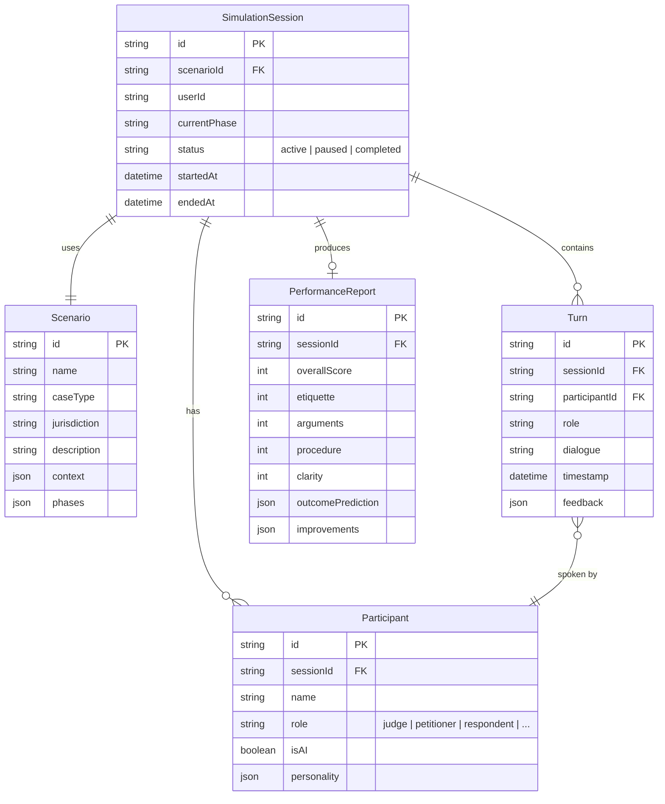

# Data Model — Court Simulation Sandbox

Entity-relationship diagram for the Court Simulation Sandbox persistence layer.

## Entity Descriptions

| Entity | Purpose |
|--------|---------|
| **SimulationSession** | Root record for a single courtroom practice run |
| **Scenario** | Pre-built or custom hearing template with facts, participants, and phases |
| **Participant** | A human or AI actor within a session (judge, petitioner, counsel, etc.) |
| **Turn** | A single dialogue exchange in the session transcript |
| **PerformanceReport** | Aggregated scores and improvement recommendations for a completed session |
